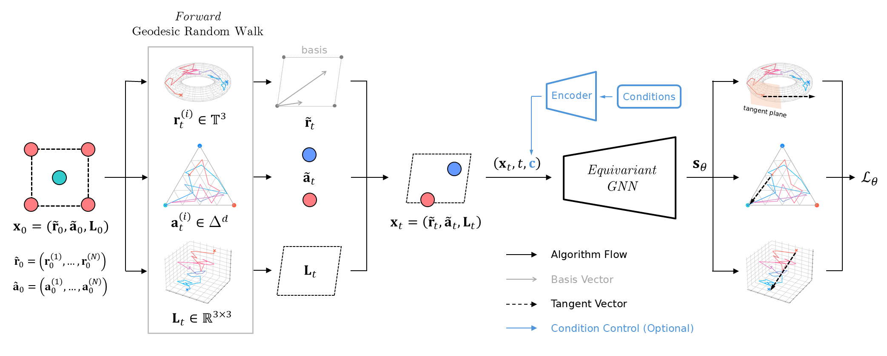
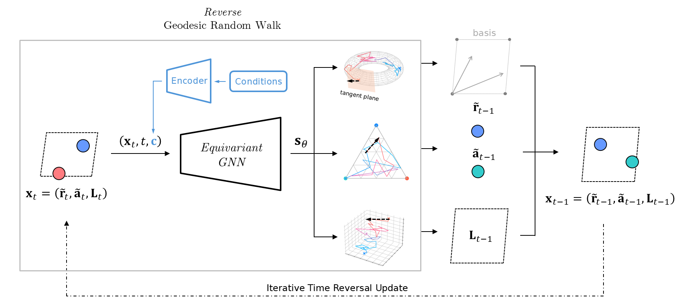

# CrystalGRW: Generative Modeling of Crystal Structures with Targeted Properties via Geodesic Random Walks
[](https://arxiv.org/abs/2501.08998)
### Training scheme for CrystalGRW
<p align="center">

</p>

Manifolds depicted in the figure are $`\mathbb{T}^2`$, $`\Delta^2`$, and $`\mathbb{R}^3`$.

### Sampling scheme for CrystalGRW
<p align="center">

</p>

## Installation
```
git clone https://github.com/trachote/crystalgrw.git
cd crystalgrw
conda env create -f environment.yaml
conda activate crystalgrw
```

## Usage
Training command:
```
python scripts/train.py --config_path conf/mp_condition.yaml \
                        --output_path output_dir
```
Generation command:
```
python scripts/evaluate.py --model_path output_dir \
                           --batch_size 8 \
                           --num_batches_to_samples 1 \
                           --num_evals 1 \
                           --adaptive_timestep 1
```
Generation with guided conditions command:
```
python scripts/evaluate.py --model_path output_dir \
                           --batch_size 8 \
                           --num_batches_to_samples 1 \
                           --num_evals 1 \
                           --adaptive_timestep 1 \
                           --labels 1 0 0 0 0 0 0 \
                           --guidance_strength 0.5
```
Compute metrics has not been tested with the current version. An update soon will come.

### Example runs with MP-20 dataset
- Unzip data/mp_20.zip
- Change path-to-folder/crystalgrw in conf/*.yaml files to ```pwd```
  - conf/mp_example.yaml is a config file for training the model.
  - conf/mp_condition.yaml is a config file for training the model with controlled conditions.
- Run commands

## Configurations
The CrystalGRW setup can corrupt three properties: 
fractional coordinates, atomic types, and lattice matrices. 
For specific tasks, you may need to corrupt only some of these properties. 
This can be configured through a config file by setting the ```corrupt_{property}``` tags.

## Citations
Ones may find this repository is useful, please cite our papers:
```
@misc{tangsongcharoen2025crystalgrw,
      title={CrystalGRW: Generative Modeling of Crystal Structures with Targeted Properties via Geodesic Random Walks}, 
      author={Krit Tangsongcharoen and Teerachote Pakornchote and Chayanon Atthapak and Natthaphon Choomphon-anomakhun and Annop Ektarawong and Björn Alling and Christopher Sutton and Thiti Bovornratanaraks and Thiparat Chotibut},
      year={2025},
      eprint={2501.08998},
      archivePrefix={arXiv},
      primaryClass={cond-mat.mtrl-sci},
      url={https://arxiv.org/abs/2501.08998}, 
}
```

### GNN submodules
Two options for the denoiser (decoder) <br>
1) [EquiformerV2](https://github.com/atomicarchitects/equiformer_v2)
```
@inproceedings{
liao2024equiformerv,
title={EquiformerV2: Improved Equivariant Transformer for Scaling to Higher-Degree Representations},
author={Yi-Lun Liao and Brandon M Wood and Abhishek Das and Tess Smidt},
booktitle={The Twelfth International Conference on Learning Representations},
year={2024},
url={https://openreview.net/forum?id=mCOBKZmrzD}
}
```
2) [GemNet-dT](https://github.com/txie-93/cdvae/tree/main/cdvae/pl_modules/gemnet)
```
@inproceedings{
klicpera2021gemnet,
title={GemNet: Universal Directional Graph Neural Networks for Molecules},
author={Johannes Klicpera and Florian Becker and Stephan G{\"u}nnemann},
booktitle={Advances in Neural Information Processing Systems},
editor={A. Beygelzimer and Y. Dauphin and P. Liang and J. Wortman Vaughan},
year={2021},
url={https://openreview.net/forum?id=HS_sOaxS9K-}
}
```
One option for the encoder (if used) <br>
3) [DimeNet++](https://github.com/txie-93/cdvae/blob/main/cdvae/pl_modules/gnn.py)
```
@misc{gasteiger2022fast,
      title={Fast and Uncertainty-Aware Directional Message Passing for Non-Equilibrium Molecules}, 
      author={Johannes Gasteiger and Shankari Giri and Johannes T. Margraf and Stephan Günnemann},
      year={2022},
      eprint={2011.14115},
      archivePrefix={arXiv},
      primaryClass={cs.LG}
}
```
